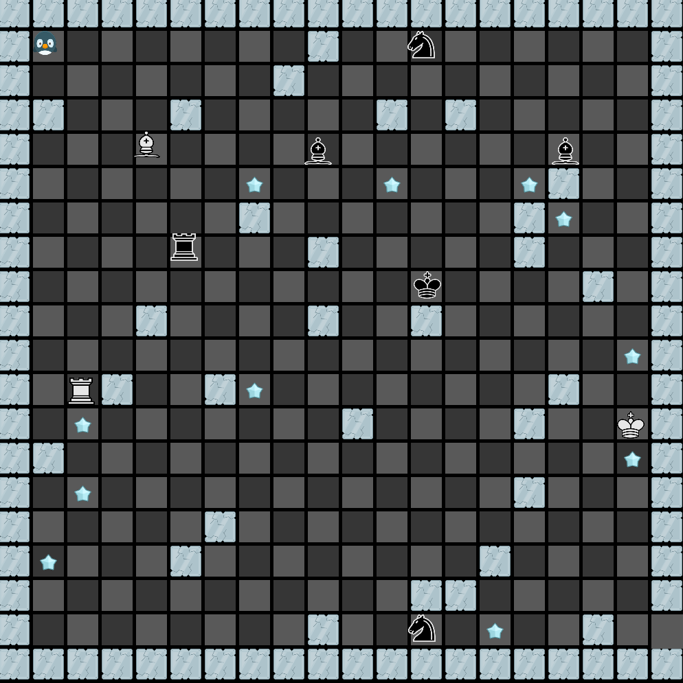

# Chess-Rush

Welcome to Chess-Rush, an exhilarating 2D escape game inspired by the timeless game of chess, brought to life with the power of OpenGL! Take on the role of Tux, our brave penguin, who finds himself lost in the icy chessland. Navigating through three challenging levels of the chessboard, Tux must outwit the warring white and black pieces, each vying for supremacy. The stakes rise with each level as the pieces become faster and more cunning in their pursuit.

As Tux, you'll need to move swiftly, utilizing the classic WASD controls, to avoid the perilous chess pieces. Beware of the ice blocks scattered throughout the board, for they can ensnare you and make your escape even more treacherous. However, amidst the chaos, there's a chance to collect cool ice stars, boosting your score and adding an extra layer of challenge to your daring adventure.

Embark on this epic journey, where chess meets escape, and experience the adrenaline rush of Chess-Rush. Will you emerge as the ultimate champion and guide Tux to safety, or will the chess pieces claim victory over our brave penguin? The adventure awaits!

## Sample Gameplay



## Installation instructions

1. Clone the repo locally and `cd` into it.
2. Build it using cmake. 
```bash
mkdir build && cd build
cmake ..
make -j
```
3. Run the game from the root of the repo
```
cd ../ && ./build/game
```
4. Enjoy!
